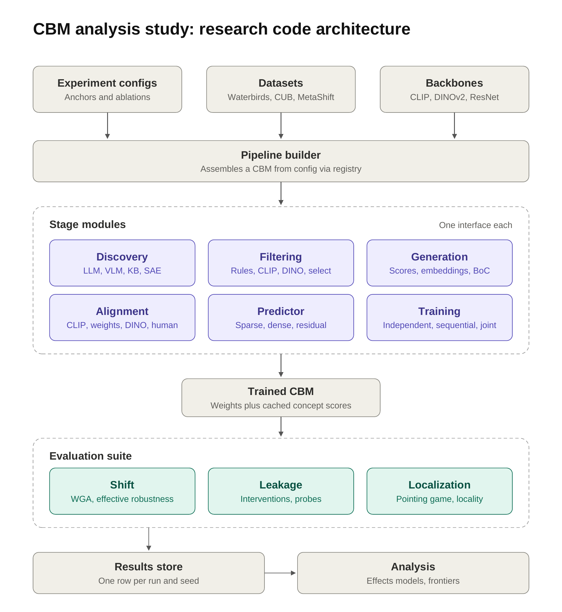

# CBM-Design-Evaluation

Research code for a controlled design study of concept bottleneck models (CBMs). A CBM is assembled
from six interchangeable stages, trained on cached backbone features, evaluated for robustness,
leakage and localization, and logged as one row per run and seed for factor-level analysis.



## Setup

```bash
uv sync                                          # core + dev group (pytest)
uv sync --all-extras                             # + CLIP, Grounding DINO, Claude discovery, mixed models
uv run pytest -q                                 # fully offline, ~5 s
```

## Quickstart

```bash
uv run cbm-eval list                                               # registered components per stage
uv run cbm-eval run configs/anchors/synthetic.yaml --seeds 0 1 2   # offline anchor
uv run cbm-eval run configs/anchors/synthetic.yaml --set stages.predictor.lam=0.01
uv run cbm-eval sweep configs/ablations/synthetic_stages.yaml --dry-run
uv run cbm-eval sweep configs/ablations/synthetic_stages.yaml
uv run cbm-eval analyze --results results/synthetic.jsonl --metric shift.test.wga --frontier leakage.intervention.gain
```

## Layout

| Diagram box | Code |
|---|---|
| Experiment configs | `configs/anchors/*.yaml`, `configs/ablations/*.yaml`, `src/cbm_eval/config.py` |
| Datasets | `data/` — `waterbirds`, `cub`, `metashift`, `synthetic` |
| Backbones | `backbones/` — `clip` (OpenCLIP), `dinov2`, `resnet`, `toy` |
| Pipeline builder | `pipeline.py` (+ `registry.py`, `context.py`) |
| Stage modules | `stages/` — one ABC per stage in `stages/base.py` |
| Trained CBM | `model.py` — weights + cached concept scores, saved to `runs/<run_id>-s<seed>/` |
| Evaluation suite | `evaluation/` — `shift`, `leakage`, `localization` |
| Results store | `results.py` — JSONL, one row per (run_id, seed) |
| Analysis | `analysis.py` — seed aggregation, effects models, Pareto frontiers, effective robustness |

### Stages

| Stage | Variants | Interface |
|---|---|---|
| Discovery | `llm`, `vlm`, `kb`, `sae`, `dataset`, `static` | `discover(ctx) -> ConceptSet` |
| Filtering (chained) | `rules`, `clip`, `dino`, `select` | `filter(concepts, ctx) -> ConceptSet` |
| Generation | `scores`, `embeddings` (CEM), `boc` | `build(in_dim, aligned) -> ConceptLayer` |
| Alignment | `clip`, `weights`, `dino`, `human` | `fit(concepts, ctx) -> AlignedConcepts` |
| Predictor | `sparse`, `dense`, `residual` | `build(rep_dim, n_classes, feat_dim) -> PredictorHead` |
| Training | `independent`, `sequential`, `joint` | `fit(layer, head, aligned, ctx) -> log` |

How the stages divide the work:

- **Alignment** decides how concept neurons get their meaning. `clip` uses continuous pseudo-labels
  (teacher image–text similarity, as in Label-free CBM); `dino` uses binary pseudo-labels from an
  open-vocabulary detector; `human` uses dataset annotations; `weights` fixes each neuron to the
  concept's text embedding (or SAE direction) with no targets.
- **Generation** decides what the predictor sees: the concept score, a CEM-style embedding mixed by
  concept probability, or a hard 0/1 bit (straight-through in joint training).
- Non-CLIP backbones need a text-capable `teacher:` for `clip` alignment and the `clip`/`select`
  filters (see `configs/ablations/waterbirds_backbones.yaml`).

## Instance bags (SEG-MIL-CBM)

[arXiv 2510.04180](https://arxiv.org/abs/2510.04180) classifies an image from a *bag* of
concept-guided segments. A top-level `instances:` key turns on bags, and every stage runs per
instance: inputs become `(N, M, D)` with a validity mask (`structures.Bag`).

| Paper component | Config |
|---|---|
| Top-K concepts per image → Grounding DINO boxes → SAM masks | `instances: {name: grounded_sam, top_k: 10}` |
| Segment features `h_i` (masked crop through the frozen backbone) | `instances.encode: crop` (or `pool`: patch tokens averaged under the mask) |
| Frozen CLIP targets `q_k(s_i)` = softmax of cosines | `alignment: {name: segment_clip, targets: softmax, temperature: 0.01}` |
| `L = CE + 0.1 · (−cos)` | `training: {name: joint, concept_weight: 0.1, concept_loss: cosine}` |
| Class-conditioned attention MIL with area weights | `predictor: {name: mil, pooling: attention, area_gamma: 0.25}` |
| Deletion / insertion faithfulness | `evaluation: [{name: faithfulness}]` |

Controls: `instances: patches | grounded_boxes | sam_grid`, `predictor.pooling: mean | max`. Image-level
alignments (`clip`, `human`, `dino`) also work on bags; their targets supervise the max over instances.
With bags, `predictor` must be bag-aware (`mil`). Without `instances:`, `mil` is a plain linear head.

Caching: masks go to `.cache/segments/` and depend on the dataset, segmenter and (for grounded
sources) the filtered concept set, but not on the backbone. Segment features go to
`.cache/instances/`, one entry per backbone. Any change to discovery or filtering re-segments
the dataset. `sam_grid` does not depend on concepts.

Differences from the paper: the backbone stays frozen (no warm-up). Faithfulness zeroes cached
segment embeddings rather than re-encoding images. Many of the paper's hyperparameters are only
in its appendix, so `top_k`, `boxes_per_concept`, thresholds and `tau` are our defaults. With the
scale-free cosine loss, intervention metrics that write targets into the concept layer are not
meaningful.

Training stays on CPU unless `training.device` is set; the SEG-MIL anchors use `device: auto`
(GPU when present). Segmentation and encoding run on the top-level `device`.

## Configs

An anchor fully specifies one run. Each stage is `{name: <variant>, **kwargs}`, and the kwargs go
straight to the variant's constructor. An ablation names an anchor and a set of factors:

```yaml
anchor: ../anchors/waterbirds_lfcbm.yaml
mode: ofat            # one-factor-at-a-time around the anchor (default), or grid
seeds: [0, 1, 2]
overrides: {teacher: {name: clip}}     # optional, applied to the anchor first
factors:
  stages.predictor: [{name: dense}, {name: residual}]
  stages.predictor.lam: [0.0001, 0.001]   # dotted keys reach into specs; list indices work too
```

A factor value **replaces** whatever sits at that key. For example, `stages.training: [{name: joint}]`
drops any `epochs` the anchor set, so constructor defaults apply. To vary one parameter, use a
dotted key instead.

The `run_id` is a hash of everything that defines the model and its evaluation. Seed, name, paths
and tags are excluded. Sweeps skip `(run_id, seed)` pairs that already succeeded, so an interrupted
sweep can simply be restarted.

## Adding a component

```python
from cbm_eval.registry import FILTERING
from cbm_eval.stages.base import Filter

@FILTERING.register("my_filter")
class MyFilter(Filter):
    def __init__(self, threshold: float = 0.5):
        self.threshold = threshold

    def filter(self, concepts, ctx):
        ...
        return concepts.subset(keep)
```

Import the module from its package `__init__.py`. It then becomes available as `{name: my_filter, threshold: 0.3}`.

## Data

Point `dataset.root` at:

- **Waterbirds**: the standard folder with `metadata.csv` (`img_filename, y, split, place`).
- **CUB**: the official `CUB_200_2011` directory. Attributes are class-level majority-voted
  (Koh et al.) by default. Each attribute is mapped to its body part's keypoint for localization.
- **MetaShift**: a folder with `metadata.csv` (`filename, y, a, split`), as produced by the
  SubpopBench preprocessing scripts.

Backbone features are cached under `paths.cache/features/` and keyed by dataset and backbone. All
runs sharing a dataset and backbone reuse them, so training a CBM runs only on cached tensors.
LLM, VLM, ConceptNet and Grounding DINO outputs are cached under the same directory.

`llm` and `vlm` discovery call Claude (`claude-opus-5-5` by default; override with `model:`). Server-side
refusal fallback is enabled. Credentials come from `ANTHROPIC_API_KEY` or an `ant auth login` profile.

## Metrics

All metrics are prefixed by their evaluator name, e.g. `shift.test.wga`.

- `shift`: per-split accuracy, per-group accuracy, worst-group accuracy (`wga`) and mean group
  accuracy. Effective robustness is reported when a `baseline: {slope, intercept}` is given.
  Otherwise, fit one over baseline runs with `analysis.fit_robustness_baseline`.
- `leakage`:
  - `intervention.acc@f` / `intervention.gain`: accuracy after replacing a random fraction `f` of
    concept predictions with ground truth. Ground truth is human annotations when every concept is
A new loss is a training subclass that overrides one hook, `_task_loss(logits, batch)` or
`_concept_loss(layer, batch)`, registered under its own name:

```python
import torch.nn.functional as F

from cbm_eval.registry import TRAINING
from cbm_eval.stages.training import Joint

@TRAINING.register("joint_smooth")
class JointSmooth(Joint):
    def __init__(self, smoothing: float = 0.1, **kw):
        super().__init__(**kw)
        self.smoothing = smoothing

    def _task_loss(self, logits, b):
        return F.cross_entropy(logits, b.y, label_smoothing=self.smoothing)
```

See `CLAUDE.md` for the full contract per component kind.

    annotated and the layer predicts binary concepts. Otherwise it is the alignment's own targets,
    and gains are then expected to be near zero for pseudo-label alignment.
  - `probe.soft_hard_gap`: accuracy of a probe on soft scores minus one on binarized scores.
  - `probe.spurious_bacc`: how well the spurious attribute can be decoded from the concepts.
- `localization`: pointing game and locality (map mass inside the annotated region, with
  `locality_chance` for reference). Only concepts that match an annotated dataset concept by name
  are scored.

## Status

The whole pipeline and every stage variant are tested end-to-end on the synthetic dataset and toy
backbone. The tests also cover the image-file path: a fake Waterbirds folder, an untrained ResNet-18,
and stub LLM/VLM clients.

**Not yet run against real data or pretrained weights:** OpenCLIP and DINOv2 feature extraction
(including ViT patch tokens), the CUB and MetaShift loaders, live Claude/ConceptNet calls, and
Grounding DINO scoring. Expect small fixes on first contact.
A response cut off at `max_tokens` (default 4000) raises instead of being cached; raise it with
`{name: llm, max_tokens: 8000}`.
